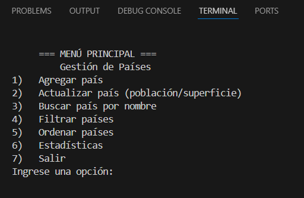
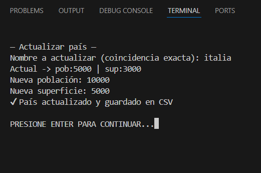
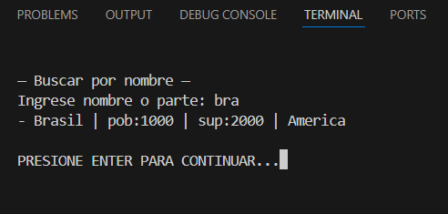
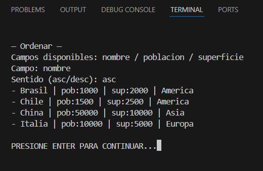
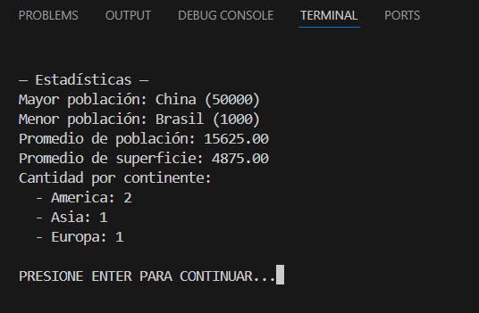

# 🌎 TPI - Gestión de Países

**Tecnicatura Universitaria en Programación (UTN - A Distancia)**  
**Materia:** Programación 1 – Segundo Cuatrimestre 2025  
**Trabajo Práctico Integrador (TPI)**  

Trabajo Práctico Integrador - Programación 1 - Bufe Yalila - Zamudio Luis

---

## 🎯 Objetivo del Proyecto

Desarrollar una aplicación de consola en **Python 3** que permita gestionar información de distintos países, aplicando los conceptos vistos en la materia: listas, diccionarios, funciones, condicionales, bucles, filtros, ordenamientos y estadísticas.

El programa debe:
- Leer y escribir datos desde un archivo **CSV**.
- Permitir **altas, búsquedas, actualizaciones y filtrados**.
- Generar **estadísticas** como promedios y máximos/mínimos.
- Mostrar información en pantalla con un menú de opciones.

---

## 🧩 Estructura del Proyecto

```
TPI_Gestion_Paises/
├── src/
│ ├── main.py # Programa principal y menú
│ ├── persistencia.py # Lectura/escritura CSV
│ ├── validaciones.py # Control de entradas y datos
│ ├── consultas.py # Búsquedas, filtros y ordenamientos
│ ├── estadisticas.py # Cálculos y promedios
│ └── datos.csv # Dataset base de países
├── capturas/
│ ├── ejemplo_menu.png
│ ├── ejemplo_filtros.png
│ └── ejemplo_estadisticas.png
├── .gitattributes
├── .gitignore
└── README.md

```

---

## ⚙️ Requisitos

- **Python 3.10** o superior  
- No requiere librerías externas  
- Compatible con Windows, Linux y macOS  

---

## ▶️ Ejecución

1. Clonar o descargar el repositorio:
   ```bash
   git clone https://github.com/luisZamudio1501/TPI_Gestion_Paises

2. Entrar a la carpeta del proyecto desde una terminal: cd TPI_Gestion_Paises/src

3. Ejecutar el programa: python main.py

## 🧠 Funcionalidades Principales

OPCIÓN    DESCRIPCIÓN                                       
1     -    Agregar un país                                   
2     -    Actualizar datos (población/superficie)           
3     -    Buscar país por nombre                            
4     -    Filtrar países por continente o rango             
5     -    Ordenar países por nombre, población o superficie 
6     -    Mostrar estadísticas generales                    
7     -    Guardar los cambios en el CSV                     
8     -    Salir del programa     


## 📊 Estadísticas

- País con mayor población

- País con menor población

- Promedio de población y superficie

- Cantidad de países por continente


## 👥 Integrantes

- Bufe Yalila Belen  -   Desarrollo y documentación  -   yalilabufe@gmail.com
- Luis Zamudio	     -   Desarrollo y documentación	 -   luiszamudio150115@gmail.com


## 🧾 Documentación Complementaria

- Informe PDF - Marco teórico y conclusiones (SUBIR MARCO TEÓRICO)

- Carpeta de capturas 
---

### 📸 Capturas de ejecución

A continuación se presentan algunas capturas del funcionamiento del programa en consola:

#### 🧭 Menú principal
Muestra las opciones del sistema al iniciar el programa.



---

#### 🟩 Agregar país
Ejemplo del proceso de carga de un nuevo país y guardado automático en el archivo CSV.


---

#### 🔍 Actualizar países
Visualización de una actualización.



---

#### 🌎 Filtros
Ejemplo de filtrado por continente.



#### 🌎 Ordenamiento
Ejemplo de filtrado por continente y ordenamiento por población.



---

#### 📊 Estadísticas
Se muestran los resultados de promedio, país con mayor/menor población y cantidad por continente.




- Video de presentación (SUBIR ACÁ EL VIDEO)